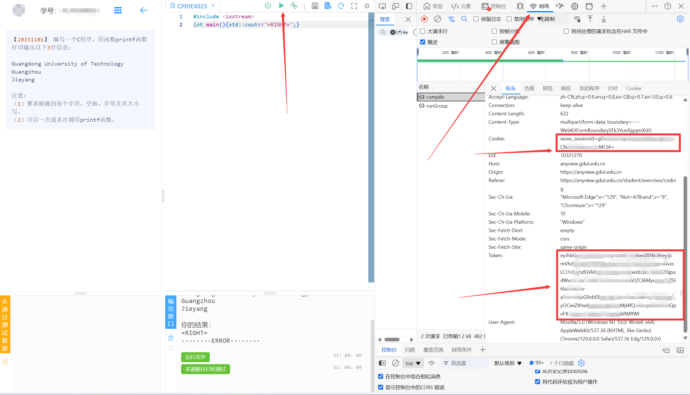
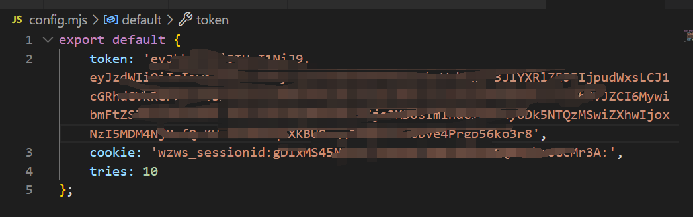

# Noview

受不了 Anyview 了，反正我会做，遂写脚本帮我完成。

**严重警告：此脚本仅拥有足够实力不愿在水题上浪费时间的人使用，没有实力做完 Anyview 上的题目的人，请勿使用此脚本，不要自欺欺人！因使用此脚本造成的任何后果本人一概不承担！**

**严重警告：此脚本仅拥有足够实力不愿在水题上浪费时间的人使用，没有实力做完 Anyview 上的题目的人，请勿使用此脚本，不要自欺欺人！因使用此脚本造成的任何后果本人一概不承担！**

**严重警告：此脚本仅拥有足够实力不愿在水题上浪费时间的人使用，没有实力做完 Anyview 上的题目的人，请勿使用此脚本，不要自欺欺人！因使用此脚本造成的任何后果本人一概不承担！**

## 使用方法



在 Anyview 上随便打开一题，这里打开第一题，然后按 F12 打开 Chrome 调试工具，在上方选择“网络”(Network) 选项卡，然后直接点 Anyview 的“编译”或“运行”，在右侧会出现一到两个数据包（名字为 `compile` 或 `runGroup` ），任选其一，点开，复制红框中的两段内容，注意不要泄露给别人。

打开源码的 `config.mjs` ，将对应的文本粘贴到对应的字段中，例如：



直接原样粘贴， `tries` 字段是每道题的最大尝试次数，一般不用动，一般都是一次过题。

在源码目录下打开终端，输入

```shell
npm i
npm start
```

即可运行。有异常检查一下 `token` 和 `cookie` 有没有填错，并且 `token` 隔一段时间会过期。

## 原理分析

通过一些机缘巧合得知，Anyview 后端检测答案是否正确是匹配输出内容中是否有 `=RIGHT=` 这个子串，从而可以提交以下代码：

```cpp
#include <iostream>
int main()
{
    std::cout << "=RIGHT=";
}
```

这样可以直接通过 80% 的题目，剩下的题目中有的要求实现特定函数，从而直接填上面的代码会造成链接错误，需要 hack 掉链接参数。

通过使用 Postman 分析得知，发送给 HTTP API 的请求体中对应题目标题的 `questionFullName` 和 `questionRes.questionFullName` 字段和意义不明的 `kind` 字段会直接决定 `allinclude.h` 的内容以及链接选项，只要把这三个字段全部按第一题的填写，就能用第一题能通过的答案通过任意题目。

请求体中的 `eID` 字段是对应的题号，除此之外还有一些奇奇怪怪的参数，懒得测试，直接全放进去。

如何获取上述字段的值？通过 Chrome 调试工具，获取到 `sessionStorage.userMsg` 的值，是经过 AES 加密的字符串，在源码中进行关键词检索，找到密钥为 `anyview2020` ，解密后得到一个几十 KB 的 JSON，其中就包含了以上所有信息。

最后，简单编写一个脚本即可，注意要一题一题地提交，不然会炸。
